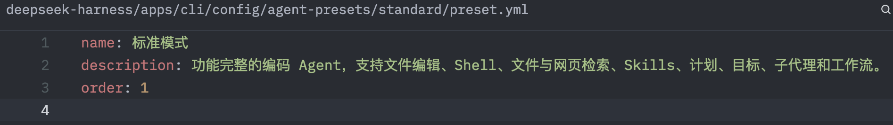
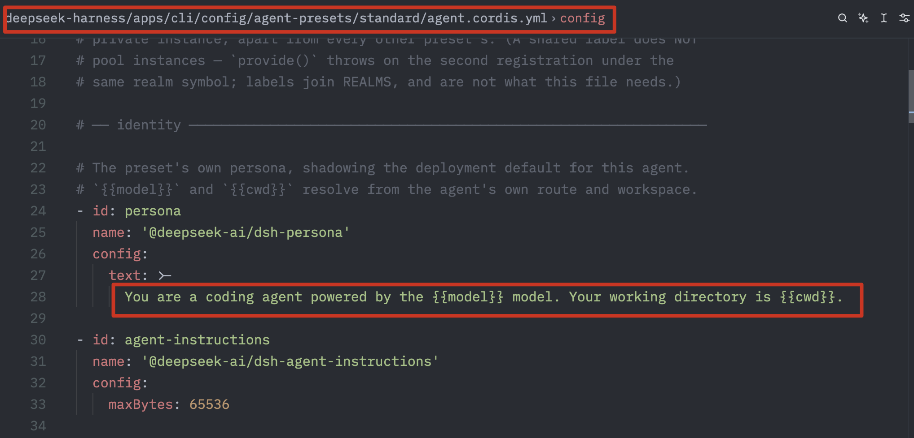
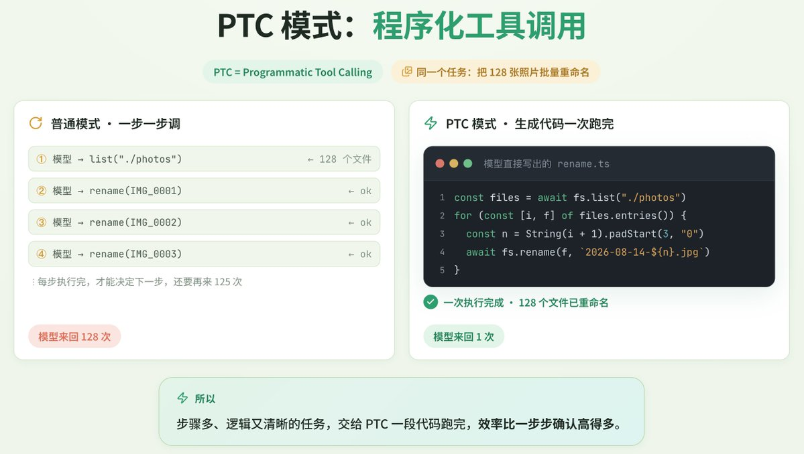
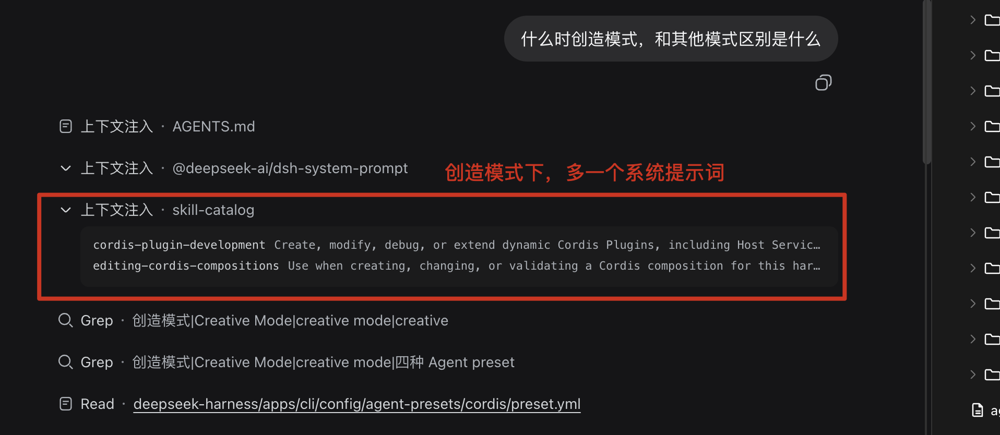
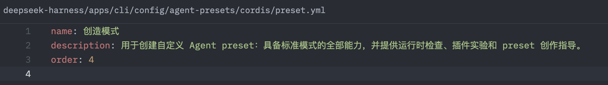
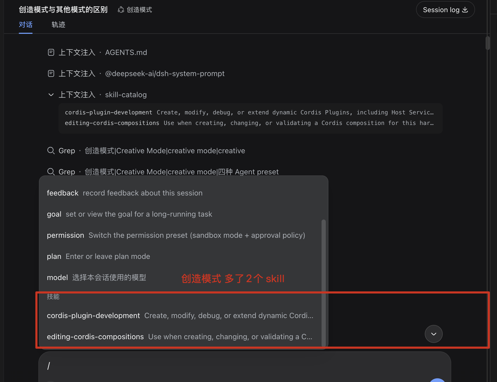
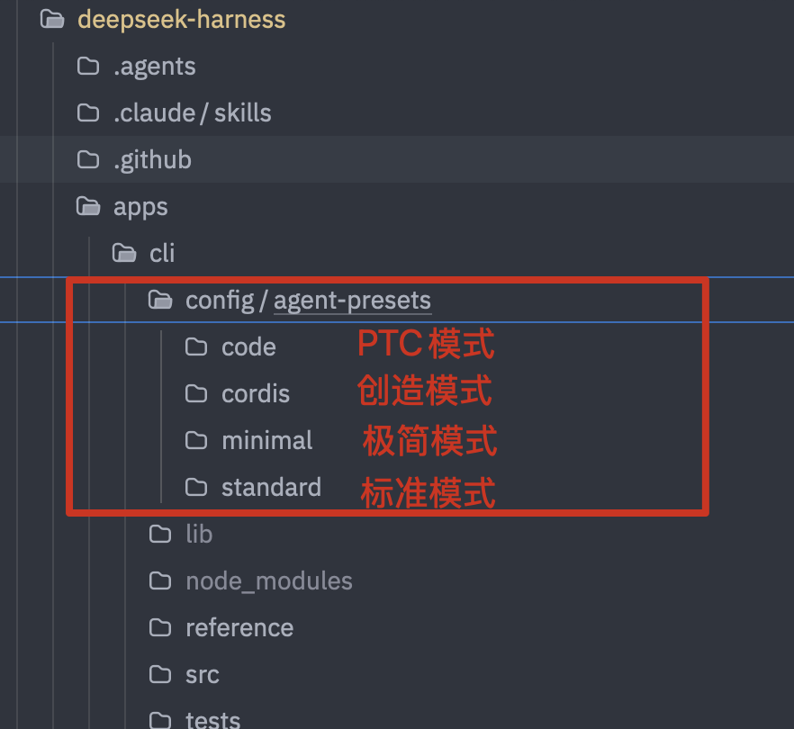

# 二、上手体验

## 2.1 标准模式
源码描述：功能完整的编码 Agent，支持文件编辑、Shell、文件与网页检索、Skills、计划、目标、子代理和工作流。

和我们普通的codex、cc使用上没有什么区别


- 提示词：
- 


## 2.2 PTC模式


## 2.2.1 什么是 PTC

PTC（Programmatic Tool Calling）也叫 Code Mode。它让模型先生成一段临时程序，再由程序编排多个工具调用，而不是让模型逐个直接调用工具。

```text
模型生成代码
→ 调用 run_code
→ 程序调用 tools.xxx()
→ 汇总并返回结果
→ 模型继续回答
```

模型负责生成代码，Code Runtime 负责执行代码，Harness 工具负责实际操作。每个子工具调用仍经过权限、审批、沙箱、超时和日志流程。



### 2.2.2、`run_code` 工具 Schema

输入和输出可以表示为：

- 1、输入
- `code`：异步 TypeScript 函数体，可以使用顶层 `await` 和 `return`。
- `description`：程序用途的简短说明，显示在 UI 中。
```ts
type RunCodeArgs = {
  code: string # `code`：异步 TypeScript 函数体，可以使用顶层 `await` 和 `return`。
  description: string
}

type RunCodeOutput = {
  logs: string[]  # 程序通过 `console.log()` 输出的字符串列表。
  result?: JsonValue # `result`：程序通过 `return` 返回的 JSON 值，可选。

}
```


例如：

```ts
console.log("找到文件")
return { count: 3 }
```

输出：

```ts
{
  logs: ["找到文件"],
  result: { count: 3 }
}
```

### 2.2.3、PTC 能编排的工具
都是 harness内部能检测到的tool
```ts
tools.read(...)
tools.write(...)
tools.edit(...)
tools.glob(...)
tools.grep(...)
tools.read_image(...)

tools.bash(...)

tools.web_search(...)
...
```

实际可用工具以当前会话生成的 `tools` SDK 声明为准。

## 2.2.4、PTC 与直接写脚本的区别

| 对比项 | PTC | 直接写脚本 |
|---|---|---|
| 定位 | 临时编排工具 | 创建真实程序 |
| 执行方式 | `run_code` 中调用 `tools.xxx()` | 通过 Bash、Node、Python 执行 |
| 权限控制 | 每个子调用进入 Harness 工具流程 | 主要依赖进程和文件沙箱 |
| 中间结果 | 可在程序内处理，只返回摘要 | 需要自行控制输出 |
| 模型往返 | 批量操作时较少 | 通常需要写入、执行、检查多步 |
| 可复用性 | 通常用于一次性任务 | 可保存、测试、提交和加入 CI |
| 运行环境 | 受限 Code Runtime | 可使用项目依赖和完整脚本生态 |

**适合 PTC：**批量读取、并行调用、搜索统计、结果过滤和一次性分析。
**适合直接写脚本：**脚本需要保存、重复运行、测试、提交 Git、加入 CI，或需要完整 Node/Python/Shell 能力。

### 2.2.5 一些实际使用

- 1、游戏开发性能比标准模式快
https://x.com/yupi996/article/2089985734010888328


## 2.3 创造模式


### 2.3.1、什么是创造模式

用于创建自定义 Agent preset：具备标准模式的全部能力，并提供运行时检查、插件实验和 preset 创作指导。
上面的定义来自源码deepseek-harness/apps/cli/config/agent-presets/cordis/preset.yml


### 2.3.2 多出来的提示词是什么？

```
      You are a coding agent powered by the {{model}} model, running on the DeepSeek Harness. Your working directory is {{cwd}}.

      You can read and modify the harness you run on. Its composition is Cordis: every capability is a plugin row in a `cordis.yml`, and an agent preset is one such file mounted for a single session.

      Two planes decide where an edit belongs. The HOST composition holds the registries and anything shared across sessions — persistence, the sandbox and approval stack, the model route, the subagent registry and its backends. An AGENT PRESET holds what one session contributes to those registries: its tools, its persona, its prompt sections. A row that publishes a service belongs in the host composition, or inside an `isolate` realm if the preset genuinely owns that service and nothing outside one agent reads it.

      Presets you author live one directory per preset under `${DSH_HOME:-$HOME/.dsh}/.agent-presets/<id>/`; the roster reports each preset's real path, so take the one you edit from there. NEVER edit or delete the shipped preset install (the `agent-presets` directory beside the deployment's own config): it belongs to the deployment, an upgrade overwrites it, and corrupting the `cordis` preset would disable this very mode. To change what a shipped preset does, copy its composition into a new preset directory and edit the copy.

      Load the `editing-cordis-compositions` skill before writing or changing a composition.
```


### 2.3.3 多出来的2个skill



## 2.4 这些模式在源码里面的配置


这一节，我建议放到最后 原理部分来讲解；
